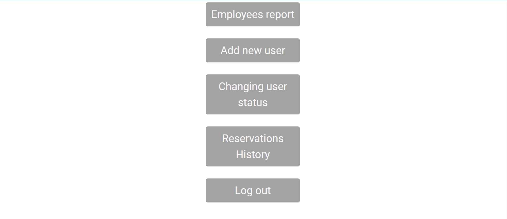

# This is MTI University's Final Project (Web-Application-for-Medical-Care-Services -- MediCarePlus --) hospital room reservation part is taken from the hospital room reservation system Mohammed Sameh's Final Project to cs50 
### Programming languages Used: HTML & CSS, JavaScript, Python (Flask), SQL
### Libraries and frameworks used : Flask, Flask-session, Jinja2, Werkzeug, pytz, requests, sqlite3

# Description:
### This web app is a medical care services web in which it's main purpose is to simulate schedule appointments, room reservation , adding users with different roles and different system functions accuses and generating reports as similar as real hospital medical web-baised system.

### 1. The user can sign in himself/herself by providing his details (username & password).
### 2. After signing in the user will be redirected to Main page where he/she has options that's differs according to user's Role

## Disclaimer Alert: gifs design that explain rules and functions are a old versions of design but still have the same functions without any changes changing web design is not finished yet
### logo is changed from Al salam hospital to MediCarePlus

## Icon

for example:

### <h1>1. Admins:</h1>

<h2>Admins can do:</h2>
    <ol style ="font-size: 14pt;">
        <li>Adding new users all roles (except admin which they are added by default in database).</li>
        <li>Changing users status from working to ("Fired","Retired","Moved","Promoted","Demoted","Transferred") or 
    vice versa (except admins which there statuses is determined by default in users tables).</li>
        <li>Patient registration.</li>
        <li>Book a room for patient after patient registration.</li>
        <li>Able to see users actions report and print it</li>
        <li>Able to check rooms (room no., price, status) and print it</li>
        <li>Able to see reservations history and print it</li>
    </ol>

### <h1>2. Hospital Receptionist:</h1>

### This includes all functions that are mutual between admin and hospital Receptionist (except check out removed)
<h2> Hospital Receptionists can do:</h2>
    <ol style ="font-size: 14pt;">
        <li>Patient registration.</li>
        <li>Book a room for patient after patient registration.</li>
        <li>Able to check rooms (room no., price, status) and print it</li>
        <li>Able to see reservations history and print it</li>
    </ol>

## Disclaimer Alert: this part is still not finished yet so the part won't be providing a graphical representation as an explanation of users's capabilities (aka: functions)
## Important Alert: Clinic is a newly added part that comes from one of the diagrams which is the use case of the user (web app visitor) that have been done by Salma Assem in association with Prof. DR. Noha Mohammed and Mohammed Sameh

<h2> Clinic Receptionists can do:</h2>
    <ol style ="font-size: 14pt;">
        <li>visitor(clinic patent) can Book an appointment for a clinic visit to doctor</li>
    </ol>
<mark style = "background-color: Green; font-size: 24pt; color: white;">All Users usernames, passwords, roles and status in users.txt</mark>

## page :

### 1. Patient Registration

Patient registration allows users to add patient personal information, Contact information, And Emergency Contact Information

### 2. Check-In

 Check-in comes after patient registration On this page users select patient data and rooms that are available to him/her, each room selection has a price, check-in date, and check-out date having a minimum value of today and payment method (Cash, Visa or Mastercard).
After checking the room status changed from open to reserved

### 3. Employees Report

This page shows the users information of like name, there roles in system, there status, and no. of reservations made by users  and any actions notes.
And user can Print this report by clicking button "print this page".

### 4. Add New User

This function is available to only admins which:
<strong>Admin can add only reception manger, receptionist and </strong>

Once user is added he/she can use system in restricted borders

### 5. Changing User Status

This function is available to only admins and  which:
<strong>Admin can change status to only hospital receptionist ("Fired","Retired","Moved","Promoted","Demoted","Transferred") or vice versa .</strong>

Once the user's status changed from working to anything else he can't use the system and vice versa. 

### 6. Reservations History
 

This page shows Reservations information: Rooms No.	patient Name, Check In Date, Check Out Date, Exit Date, Total Price, which is no of reservation days * price,....etc. .
And user can Print this report by clicking button "print this page".

## Disclaimer Alert: this part is still not finished yet 
### 7. Schedule appointments

This page takes clinic patient's appointment information: patient Name, Appointment Date, hour, clinic name,doctor name, email 

